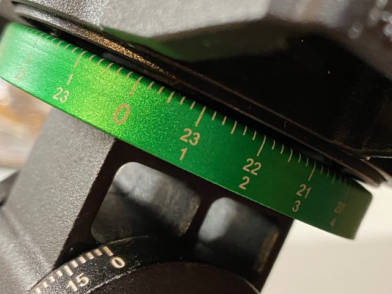
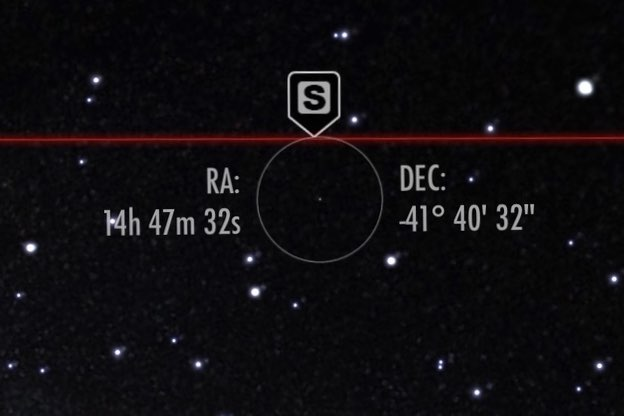
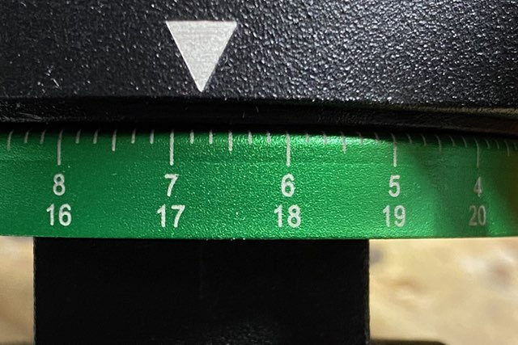

# Fixed-axis location of Right Ascension (RA) objects

A trick to rapidly locate celestial objects using a telescope and a fixed
[Right Ascension] (RA) axis.

These instructions and the accompanying Python 3 utility, allow you to avoid
having to continually calibrate a telescope's RA axis for a given viewing
location.

When a telescope is calibrated as described you just have to add the current
time of day (UTC) to any desired RA co-ordinate in order to obtain a value
on the telescope's fixed (one-time-calibrated) RA axis. i.e. the axis does not
need to be altered while the viewer remains at a given location.

You will need: -

- A telescope with an [Equatorial mount]
- An app that uses a smartphone's compass to provide you with real-time
  RA co-ordinates (I use [SkyView] on an iPhone 11)
- A compass (or smartphone with a compass)

> This trick is based on the fact that although the celestial co-ordinates
  do change over time (due to [Axial precession]) that change is so slow you
  don't really have to adjust your reference point for many years. Your
  RA axis is probably only graduated every 5 or 10 minutes anyway making
  adjustments even less likely.

## Background
I have my first telescope, but I'm just learning.

Even though I've just started, there is already one thing that I have found
particularly annoying on my telescope (a SkyWatcher [StarQuest-130P]).
It's the adjustment of the RA axis.

It's an entry-level telescope, albeit a very good one, but the RA axis is a 
thin aluminium cover that sits underneath the RA axis on the underside of the
mount.

Unfortunately turning the disk on this model turns out to be quite fiddly -
it's not on bearings, is not lubricated, and it often gets stuck! And if it
takes you 10 minutes to actually set the axis you're 10 minutes out on the
RA Axis - which is a significant deviation from where it is by the time you're
ready. And you have to keep doing it as the night progresses?

So I sat there, thinking ... _"Hold on! I've got to do this every night?
In the dark? All night?"_.

I started to realise that this was going to turn out to be really annoying.

The trouble with the _"commonly accepted"_ method - i.e. "finding a star you
recognise" and then adjusting the ring after pointing your telescope at it
just seemed, to me, to be too complicated.

It relies on a number of actions: -

1. You need to know your stars, at least one, probably more including their
   RA values
2. You have to be able to see your chosen star. You might not be able to
   because of an obstruction (tree/house) or cloud cover
3. It needs to be dark - you can't see many stars when the Sun's shining!
4. You have to keep adjusting the RA ring as the night passes
   (because RA 0h 0m is moving relative to your location)

As a software engineer with a passion for automation I thought
"There has to be a better (faster) way". After all, once you know
the RA coordinate of any position in the sky you know it's going to be the same
value every 24 hours.

So I got to thinking ... if you set the RA axis ring once (and you know what
time it was when you did it) you can use any new time to calculate an _offset_
that can be used against your fixed axis.

And this is the trick I employ here.

The result is a method where, for any given viewing location
(any longitude), you simply need to calibrate the telescope's RA axis
once, during the day when it's convenient. Then, given a new time of day
and _target_ RA co-ordinate, you calculate a co-ordinate *offset* using the
time and apply that to your scale. You don't need to re-calibrate the RA ring
as long as you observe the sky from the same location (longitude).

## Calibrating the RA axis
**Step 1**

Set your telescope up at your viewing location. You will need to follow the
standard setup procedure - i.e. polar-align the mount.

**Step 2**

Turn the telescope on its RA axis so that it is pointing directly
**South** (or **North** if you're in the southern hemisphere). You can do this
using a standard compass (using **True North** rather than **Magnetic North**)
to locate any distant landmark or feature that is directly South (or North) of
your position.

In this picture the telescope has been removed for clarity.

**Step 3**

Standing clear of any large metal objects (and the tripod) use your smartphone
app ([SkyView]) and turn to face south, making sure the app is displaying
real-time RA co-ordinates. SkyView is quite good for this
as it highlights the key compass points and the real-time co-ordinates
using a handy reticule.

Take a note of the current time and the RA co-ordinate of the southern compass
point (positioning the reticule a little more accurately than this quick
screenshot illustrates)...

In this example the current RA co-ordinate of the South compass point is
(approximately) `14h 47m`.

**Step 4**

Adjust the RA co-ordinate to the value that would be found at the South 
compass point if it were midnight, i.e. subtract the current time from your
current reading.

In the above example the RA co-ordinate of South is `14h 47m` so,
if the measurement was taken at 08:00 subtract 8 hours
from the co-ordinate. In our example this would result in a
value of `6h 47m`.

> That's the RA-co-ordinate of **South**, at your location, at midnight.

It's essentially a constant ... if your telescope is pointing directly South,
from the calibrated viewing location, it will be pointing at `RA 6h 47m`
(in our example) at midnight.

> Remember, if you're in a location that observes Daylight Saving Time,
  you will want to adjust your telescope RA axis every time it changes
  (every 6 months or so), unless you want to or are able to use UTC
  as your "clock".

> You could do all this at midnight and not do the maths, but at midnight
  it's dark, cold and unnecessary.

**Step 5**

Now it's time to adjust your telescope's RA axis.

Using the midnight co-ordinate you calculated above, set your RA axis
to that value. In our case it's `6h 47m`.

That's it.

Now, to locate any celestial object, you just need to know the
object's RA co-ordinate and the current time of day (remembering to account
for Daylight Saving Time as mentioned earlier, if you need to).

## Locating objects using the fixed RA calibration
You've calibrated your RA axis, sometime during the day, and now
you want to locate an object.

Let's say you want to locate **Capella** in the constellation of [Auriga].

You look up the object's co-ordinate and realise you need to turn your telescope
to `5h 16m` (the RA co-ordinate of **Capella**). But, as your RA axis is
statically calibrated for _midnight_ you can't use it directly. Instead,
you have to adjust the target co-ordinate using the current time.
As the axis uses hours and minutes as the measurement this is easy.

If it's 11PM add `23h` to your target co-ordinate (`5h 16m`).
This yields the new value `4h 16m`, which is the corrected value for your
fixed RA axis.

Rotate your telescope to `4h 16m` and, with the correct declination
(`+45 degrees 59 minutes`) you should be (roughly) centred on **Capella**.

In summary - we have a handy trick - the rapid location of
objects using celestial coordinates without needing to adjust the RA axis!

## Running the software utility
You can of course, in your head, add the current UTC time to your target
value. 

If you can do that in your head than all the better, because you won't need
to run this software. But, if you aren't good at mental arithmetic this
code will help you.

Clone the repository and, from a suitable Python environment, run the
utility directly: -

    $ python -m venv ~/.venv/ra-converter
    $ source ~/.venv/ra-converter/bin/activate
    $ python ra_converter.py

Enter the RA co-ordinate of your object, and the code will use the current time
and present you with the _adjusted_ co-ordinate that you need to use
on your telescope.

---

[auriga]: https://en.wikipedia.org/wiki/Auriga_(constellation)#/media/File:Auriga_IAU.svg
[axial precession]: https://en.wikipedia.org/wiki/Axial_precession
[daylight saving time]: https://en.wikipedia.org/wiki/Daylight_saving_time
[equatorial mount]: https://en.wikipedia.org/wiki/Equatorial_mount
[right ascension]: https://en.wikipedia.org/wiki/Right_ascension
[skyview]: https://apps.apple.com/us/app/skyview/id404990064
[starquest-130p]: https://www.skyatnightmagazine.com/reviews/telescopes/sky-watcher-starquest-130p-newtonian-reflector-review/
